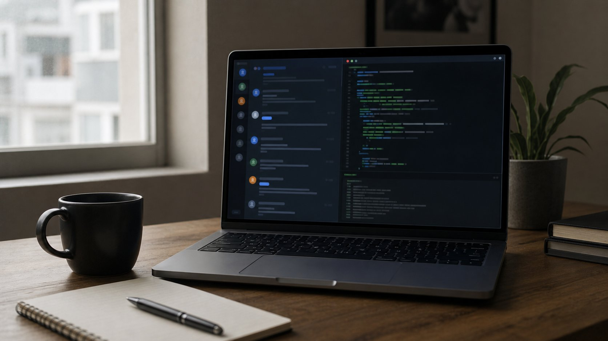
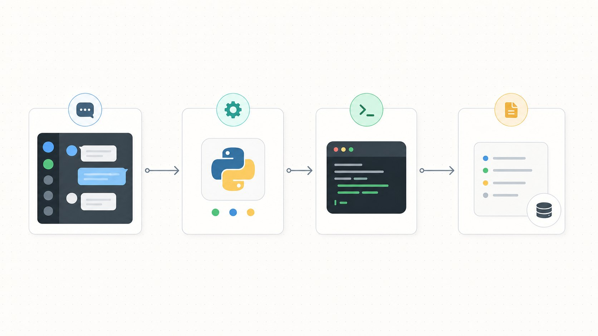
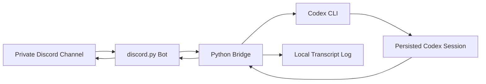

<p align="center">
  
</p>

<h1 align="center">Discord Codex Bridge</h1>

<p align="center">
  Control a specific local Codex conversation from a private Discord channel.
</p>

<p align="center">
  <a href="#quick-start">Quick start</a> |
  <a href="#discord-setup">Discord setup</a> |
  <a href="#configuration">Configuration</a> |
  <a href="#security-model">Security</a> |
  <a href="#troubleshooting">Troubleshooting</a>
</p>

<p align="center">
  
  
  
  
</p>

## What It Does

Discord Codex Bridge is a tiny Python service that listens to a Discord bot and forwards messages into a chosen Codex session:

```text
Discord channel -> discord.py bot -> Python bridge -> codex exec resume <session-id> -> Discord reply
```

It is useful when you want to steer a local Codex thread from your phone, a shared private Discord channel, or a lightweight remote-control surface without keeping the Codex desktop app in front of you.

<p align="center">
  
</p>



## Features

- Resume a fixed Codex session by id, or use the latest local session.
- Restrict access by Discord channel id and optional user id.
- Mention the bot or use a command prefix such as `!codex`.
- Queue messages one at a time so one channel cannot launch overlapping turns.
- Split long Codex replies into Discord-sized chunks.
- Keep local JSONL transcripts for debugging.
- Run locally on Windows, macOS, or Linux as long as Codex CLI works there.

## Quick Start

Clone and enter the project:

```powershell
git clone https://github.com/xkqin/discord_codex_bridge.git
cd discord_codex_bridge
```

Install dependencies:

```powershell
python -m pip install -r requirements.txt
```

Copy the environment template:

```powershell
copy .env.example .env
```

Fill in `.env`, then start the bot:

```powershell
python discord_codex_bridge.py
```

In Discord:

```text
!codex status
!codex sessions
!codex help me inspect this project
```

On Windows you can also double-click:

```text
run_discord_codex_bridge.bat
```

## Discord Setup

1. Open the Discord Developer Portal:

   <https://discord.com/developers/applications>

2. Click **New Application** and create an app.

3. Open **Bot**, then create or reset the bot token. Copy the token into `.env`:

   ```text
   DISCORD_BOT_TOKEN=your-token-here
   ```

4. In the same **Bot** page, enable **Message Content Intent** under privileged gateway intents. Save changes.

5. Open **OAuth2** -> **URL Generator**.

6. Under **Scopes**, enable:

   ```text
   bot
   ```

7. Under **Bot Permissions**, enable:

   ```text
   View Channels
   Send Messages
   Read Message History
   ```

8. Open the generated invite URL and add the bot to your server.

9. In Discord, enable **Developer Mode**:

   ```text
   User Settings -> Advanced -> Developer Mode
   ```

10. Right-click the private channel you want to use and choose **Copy Channel ID**. Put it in `.env`:

   ```text
   DISCORD_ALLOWED_CHANNEL_IDS=123456789012345678
   ```

## Codex Setup

Make sure Codex CLI works on the machine that will run the bridge:

```powershell
codex --help
```

If the Windows Store shim fails, set the real CLI path explicitly:

```text
CODEX_CLI_PATH=C:\Users\you\AppData\Local\OpenAI\Codex\bin\<id>\codex.exe
```

List recent local Codex sessions:

```powershell
python discord_codex_bridge.py --list-sessions
```

Then choose one:

```text
CODEX_TARGET_SESSION_ID=019f4002-16f0-7183-97e6-6239f50848eb
CODEX_USE_LAST=0
```

If you prefer "whatever session was most recently updated":

```text
CODEX_TARGET_SESSION_ID=
CODEX_USE_LAST=1
```

## Configuration

Minimal `.env`:

```text
DISCORD_BOT_TOKEN=your-token
DISCORD_ALLOWED_CHANNEL_IDS=123456789012345678
DISCORD_CODEX_PREFIX=!codex

CODEX_TARGET_SESSION_ID=your-codex-session-id
CODEX_USE_LAST=0
CODEX_WORKDIR=C:\path\to\your\workspace
CODEX_TIMEOUT_SECONDS=900
```

Useful options:

| Variable | Default | Purpose |
| --- | --- | --- |
| `DISCORD_ALLOWED_CHANNEL_IDS` | empty | Comma-separated channel allow-list. Strongly recommended. |
| `DISCORD_ALLOWED_USER_IDS` | empty | Optional user allow-list. |
| `DISCORD_CODEX_PREFIX` | `!codex` | Prefix that triggers the bot. Mentions also work. |
| `DISCORD_CODEX_ACCEPT_ALL` | `0` | If `1`, every message in allowed channels is forwarded. |
| `DISCORD_MAX_REPLY_CHARS` | `1800` | Max chunk size for Discord replies. |
| `CODEX_TARGET_SESSION_ID` | empty | Fixed Codex session to resume. |
| `CODEX_USE_LAST` | `1` | Use newest local Codex session if no fixed id is set. |
| `CODEX_WORKDIR` | repo dir | Working directory for Codex CLI. |
| `CODEX_MODEL` | empty | Optional model override. |
| `CODEX_TIMEOUT_SECONDS` | `900` | Per-turn timeout. |
| `CODEX_ALLOW_DANGEROUS` | `0` | Adds `--dangerously-bypass-approvals-and-sandbox`. Use with care. |
| `CODEX_CLI_PATH` | auto | Optional direct path to `codex.exe` / `codex`. |

## Local Test Commands

Check resolved config without printing the token:

```powershell
python discord_codex_bridge.py --status
```

Build the prompt without calling Codex:

```powershell
python discord_codex_bridge.py --dry-run "hello"
```

Call Codex once without Discord:

```powershell
python discord_codex_bridge.py --once "Reply only: OK"
```

## Running In The Background

Windows PowerShell example:

```powershell
$repo = "C:\path\to\discord_codex_bridge"
$out = Join-Path $repo "data\discord_codex_bridge\bot.out.log"
$err = Join-Path $repo "data\discord_codex_bridge\bot.err.log"
New-Item -ItemType Directory -Force -Path (Split-Path $out)
Start-Process python `
  -ArgumentList "discord_codex_bridge.py" `
  -WorkingDirectory $repo `
  -RedirectStandardOutput $out `
  -RedirectStandardError $err `
  -WindowStyle Hidden
```

Stop it:

```powershell
Get-CimInstance Win32_Process |
  ? { $_.CommandLine -like '*discord_codex_bridge.py*' } |
  % { Stop-Process -Id $_.ProcessId -Force }
```

## Security Model

Treat the Discord channel as a remote-control surface for your local Codex CLI.

Recommended defaults:

- Use a private Discord channel.
- Set `DISCORD_ALLOWED_CHANNEL_IDS`.
- Set `DISCORD_ALLOWED_USER_IDS` if the channel has more than one person.
- Keep `CODEX_ALLOW_DANGEROUS=0` unless you fully trust every allowed user.
- Never commit `.env`.
- Reset the Discord bot token immediately if it is pasted into chat or logs.

The bridge stores debug transcripts under:

```text
data/discord_codex_bridge/transcript.jsonl
```

That file is ignored by Git because it may contain prompts, local paths, and model replies.

## Troubleshooting

### Bot is online but does not reply

Check:

- The message starts with `!codex`, or mentions the bot.
- The channel id is listed in `DISCORD_ALLOWED_CHANNEL_IDS`.
- **Message Content Intent** is enabled in the Discord Developer Portal.
- The bot has permission to read and send messages in that channel.

### `Set DISCORD_BOT_TOKEN in .env`

Create `.env` from `.env.example`, then fill `DISCORD_BOT_TOKEN`. If you edited the file with Windows tools, this project tolerates a UTF-8 BOM in the first line.

### Codex CLI cannot be found

Run:

```powershell
codex --help
```

If that fails, set:

```text
CODEX_CLI_PATH=C:\Users\you\AppData\Local\OpenAI\Codex\bin\<id>\codex.exe
```

### Codex replies slowly

The bridge waits for the full Codex turn before posting the reply to Discord. Increase:

```text
CODEX_TIMEOUT_SECONDS=1800
```

### WebSocket 403 warnings

Codex CLI may log WebSocket 403 warnings and then fall back to HTTPS. If the command still completes, this is noisy but not fatal.

## Optional Codex Skill

This repo includes a small optional skill at:

```text
skills/discord-codex-bridge/SKILL.md
```

You can copy that folder into your Codex skills directory if you want Codex to remember this bridge's setup and troubleshooting workflow.

## Image Credits

The README images in `assets/` were generated for this repository with Codex image generation. They are documentation art, not screenshots of Discord, OpenAI, or Codex products. The Mermaid diagram is kept as a lightweight fallback and a copyable architecture reference.

